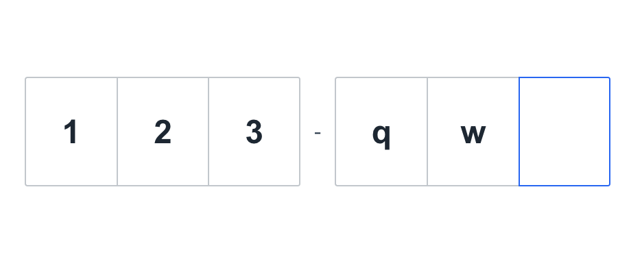

# CodeBox


### React 验证码输入组件

### 截图


### [demo](https://liruifengv.github.io/verify-code-box/)


### 安装
```
npm install verify-code-box
```

### 基本用法

```
import CodeBox from "verify-code-box"

const codeRef = useRef()

// 清空
const clear = () => {
  codeRef.current.clear()
}

const onChange = val => {
  console.log('val:', val)
}

<CodeBox ref={codeRef} onChange={onChange} />

```

###  Attributes
| 参数        | 说明           | 类型  | 可选值 | 默认值 |
| ------------- |:-------------:| :-----|:-----|:-----|
| ref   | 实例 |   func | ——— | ——— |
| onChange   | change事件 |   func | ——— | ——— |


### 实例方法

| 方法名        | 说明           | 参数  |
| ------------- |:-------------:| :-----|
| clear   | 清除 | ——— |

## License

verify-code-box is released under the MIT License. See the bundled
[LICENSE](./LICENSE) file for details.
